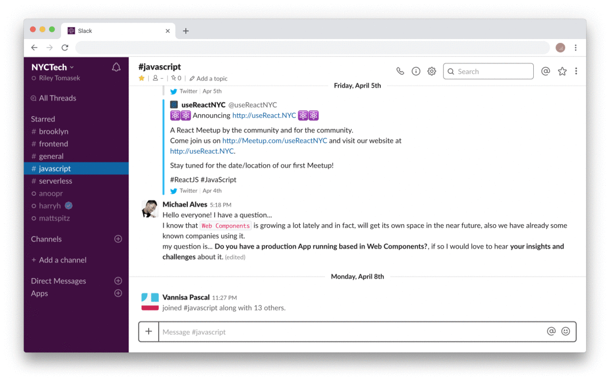

#  Tight

> A browser extension that simplifies the Slack interface, making it
> easier to focus.

Like many people, I am forced to use Slack on a daily basis. I noticed
a lot of opportunities for simple improvements in the interface, so I have
implemented them here.

The first goal of open sourcing this and publishing [the extension](https://chrome.google.com/webstore/detail/bcepjjjdnkimgfmchbjlglhgbcelfoaa) is so
that others can also enjoy these improvements and contribute to further
improvements. Both [Refined
GitHub](https://github.com/sindresorhus/refined-github) and [Refined
Twitter](https://github.com/sindresorhus/refined-twitter) are currently
doing a great job of this.

The second goal is that Slack will notice and implement some of these much
needed improvements to their product. If you like any of these changes,
please let Slack know!

Read the [blog post](https://rile.yt/tight-making-slack-usable) or discuss on [Hacker News](https://news.ycombinator.com/item?id=17877737) / [Product Hunt](https://www.producthunt.com/posts/tight)

## Setup

1. Install the [Tight Chrome
   extension](https://chrome.google.com/webstore/detail/bcepjjjdnkimgfmchbjlglhgbcelfoaa)
2. Login to [slack.com](https://slack.com/signin)
3. Enjoy!

## Contribute

Suggestions and pull requests are highly encouraged!

## Thanks

I'd like to thank Sindre Sorhus and all of the other contributors to
Refined Twitter and Refined GitHub. I love both of them and they were the
primary inspiration for my work here.

## Disclaimer

Tight does not modify, overwrite, reverse engineer or interact with any of
Slack's server or client code. It is purely CSS and impacts only the
appearance of Slack in your browser, not anyone else's.

## License

MIT
